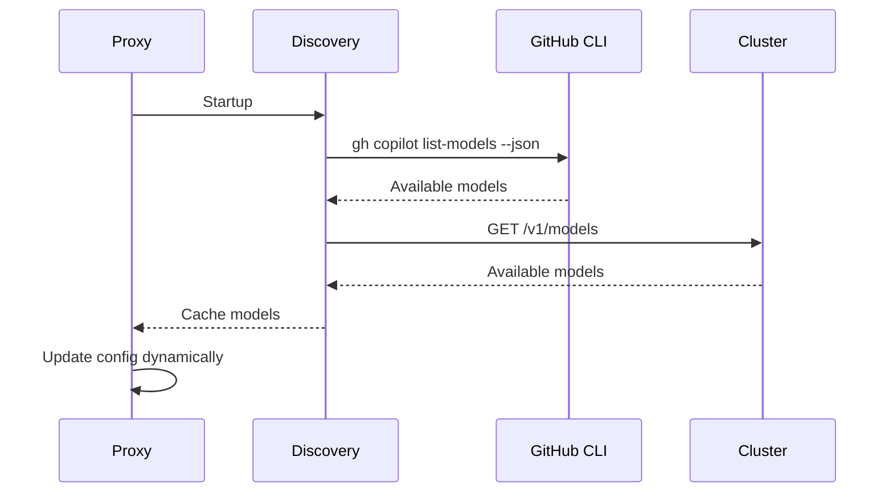
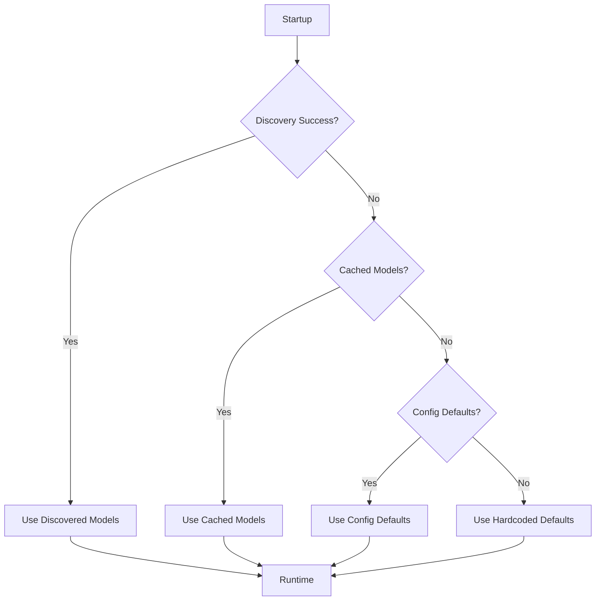

# Model Auto-Discovery

**Latest Update**: June 2026

## Overview

Token Miser automatically discovers available models from your providers and private cluster, eliminating the need to manually configure model names.

## How It Works



## Configuration

### Enable Auto-Discovery

```toml
[providers.github_copilot]
auto_discover_models = true
auth_type = "GitHubOAuth"
```

### Disable Auto-Discovery (Manual Mode)

```toml
[providers.github_copilot]
auto_discover_models = false

[providers.github_copilot.model_mapping]
default = "gpt-4o"
```

## Supported Discovery Methods

### 1. GitHub Copilot

**Method**: GitHub CLI (`gh` command)

**Prerequisites**:
```bash
# Install GitHub CLI
brew install gh  # macOS
# or
sudo apt install gh  # Linux

# Authenticate
gh auth login
```

**Discovery Command**:
```bash
gh copilot list-models --json
```

**Output Example**:
```json
[
  {
    "id": "gpt-4o",
    "name": "GPT-4o",
    "capabilities": {
      "supports_streaming": true,
      "supports_tools": true,
      "supports_vision": true,
      "max_tokens": 128000
    },
    "billing": {
      "tier": "business"
    }
  },
  {
    "id": "gpt-4o-mini",
    "name": "GPT-4o Mini",
    "capabilities": {
      "supports_streaming": true,
      "supports_tools": true,
      "supports_vision": true,
      "max_tokens": 128000
    },
    "billing": {
      "tier": "individual"
    }
  }
]
```

**Available Models by Tier**:
- **Individual**: `gpt-4o-mini`, `gpt-4o`
- **Business**: + `gpt-4`, `gpt-4-turbo`
- **Enterprise**: + Advanced features

### 2. Private/Enterprise Cluster

**Method**: OpenAI-compatible `/v1/models` endpoint

**Example**:
```bash
curl https://llm-cluster.internal.example.com/v1/models
```

**Response**:
```json
{
  "data": [
    {"id": "llama-3.1-70b"},
    {"id": "deepseek-coder-33b"},
    {"id": "llama-3.2-1b"}
  ]
}
```

## API Usage

### Check Available Models

```bash
curl http://localhost:8080/v1/models
```

**Response**:
```json
{
  "providers": {
    "github_copilot": {
      "models": ["gpt-4o", "gpt-4o-mini"],
      "discovered_at": "2026-06-06T00:00:00Z"
    },
    "tier2_standard": {
      "models": ["llama-3.1-70b", "deepseek-coder-33b"],
      "discovered_at": "2026-06-06T00:00:00Z"
    }
  }
}
```

### Refresh Model Cache

```bash
curl -X POST http://localhost:8080/v1/models/refresh
```

## Fallback Behavior

If discovery fails, Token Miser falls back to:

1. **Cached models** from previous discovery
2. **Default models** from config.toml
3. **Hardcoded defaults** (last resort)



## Limitations

### GitHub Copilot

1. **Requires GitHub CLI**: Must be installed and authenticated
2. **Subscription-dependent**: Models vary by tier
3. **No model control**: Copilot auto-selects based on request
4. **Rate limits**: May be limited by GitHub's API

### Private/Enterprise Cluster

1. **Network requirement**: Must have access to cluster
2. **OpenAI compatibility**: Cluster must implement `/v1/models`

## Best Practices

1. **Enable discovery** for all providers
2. **Monitor logs** for discovery failures
3. **Set fallback models** in config as backup
4. **Refresh periodically** to detect new models
5. **Document discovered models** in your team wiki

## Example: Full Configuration

```toml
[providers.github_copilot]
endpoint = "https://api.githubcopilot.com"
auth_type = "GitHubOAuth"
auto_discover_models = true

[providers.tier2_standard]
endpoint = "https://llm-cluster.internal.example.com/v1"
auth_type = "None"
auto_discover_models = true

# Fallback mappings (used if discovery fails)
[providers.github_copilot.model_mapping]
default = "gpt-4o"

[providers.tier2_standard.model_mapping]
default = "llama-3.1-70b"
```

## Troubleshooting

### Discovery Fails

**Check GitHub CLI**:
```bash
gh auth status
gh copilot list-models --json
```

**Check Cluster**:
```bash
curl https://llm-cluster.internal.example.com/v1/models
```

### Models Not Updating

1. Clear cache: `DELETE /v1/models/cache`
2. Restart proxy
3. Check logs: `RUST_LOG=debug cargo run`

### Wrong Models Listed

1. Check subscription tier matches expectations
2. Verify authentication status
3. Contact provider support

## Future Enhancements

- [ ] Automatic model capability detection
- [ ] Price/cost information
- [ ] Model performance metrics
- [ ] Periodic background refresh
- [ ] Webhook notifications on model changes
