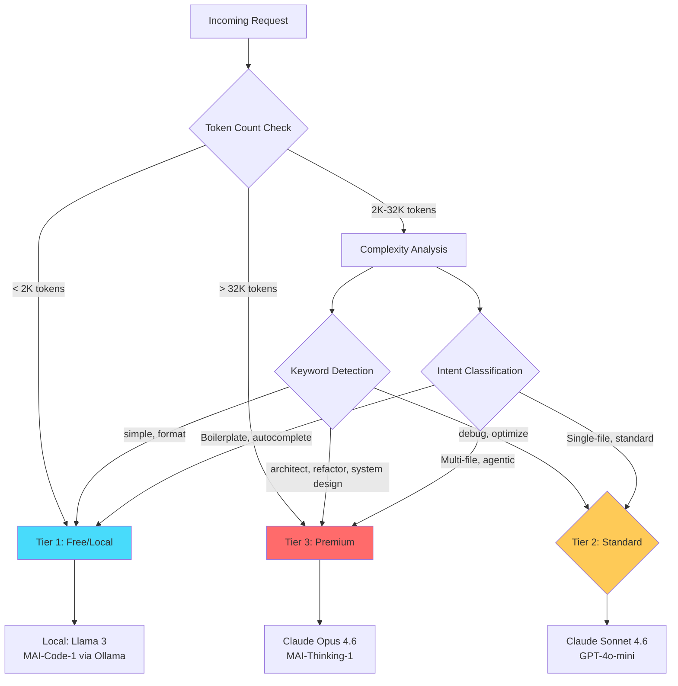
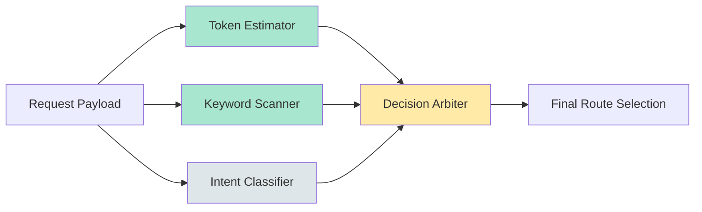
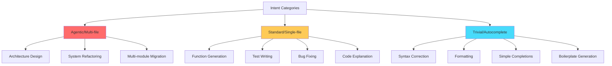
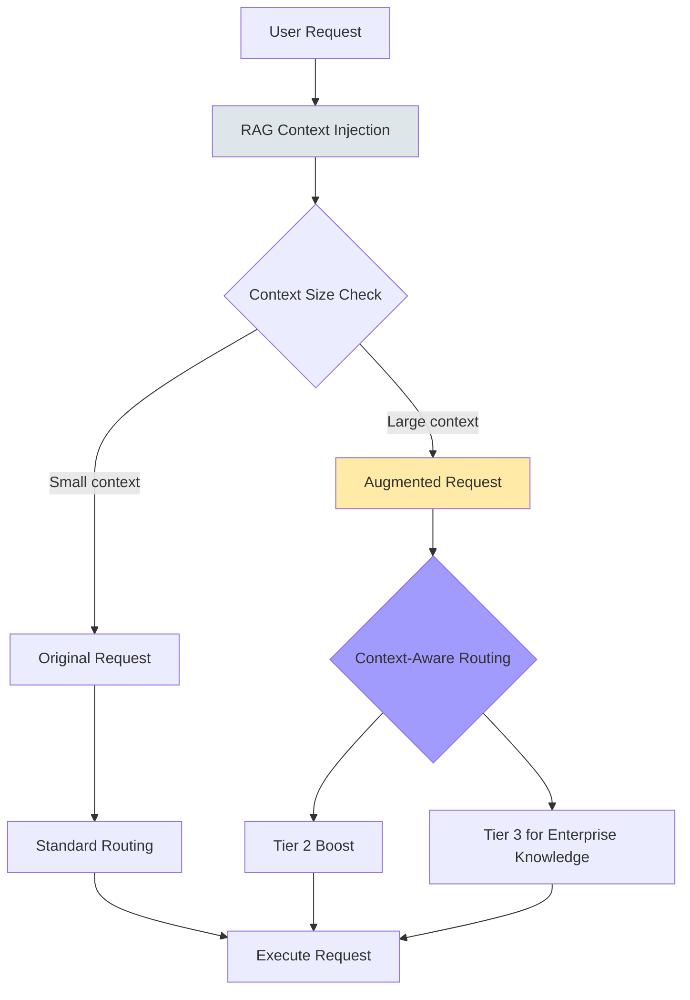

# Routing Heuristics Architecture

## Decision Flow Diagram

## Parallel Evaluation Strategy

## Payload Inspection Methods

### 1. Token Counting (Fast: ~5-10ms)
- **Method**: Use `tiktoken-rs` cl100k_base tokenizer
- **Threshold**: 32K tokens triggers Tier 3
- **Cost**: Near-zero latency overhead

### 2. Keyword Matching (Fast: <2ms)
- **Tier 3 Keywords**: `architect`, `system design`, `multi-file`, `migrate`, `redesign`
- **Tier 2 Keywords**: `refactor`, `implement`, `debug`, `optimize`, `explain`
- **Tier 1 Keywords**: `format`, `simple`, `quick`, `autocomplete`

### 3. Fast LLM Classifier (Fast: ~50-200ms)
- **Model**: Local Llama 3.2 1B or quantized 0.5B model
- **Purpose**: Classify intent before routing main request
- **Categories**: `agentic`, `standard`, `trivial`

### 4. Context Window Analysis
- **Method**: Count file references, code blocks, context injection size
- **Threshold**: >10 files or >20K injected context → Tier 3

## Intent Classification Categories

## RAG Integration Context

## Performance Budgets

| Inspection Method | Latency Budget | CPU Impact | Accuracy |
|-------------------|----------------|------------|----------|
| Token Counting | 5-10ms | Low | High |
| Keyword Matching | 1-2ms | Very Low | Medium |
| Intent Classifier | 50-200ms | Medium | Very High |
| Context Analysis | 2-5ms | Low | High |

**Target Total**: <50ms overhead for routing decision (without intent classifier)
**With Intent Classifier**: <250ms (only invoked on ambiguous cases)

## Implementation Priority

1. **Phase 1** (Current): Token counting + keyword matching
2. **Phase 2**: Add intent classifier for ambiguous cases
3. **Phase 3**: Integrate RAG context size analysis
4. **Phase 4**: Add adaptive learning based on routing outcomes
